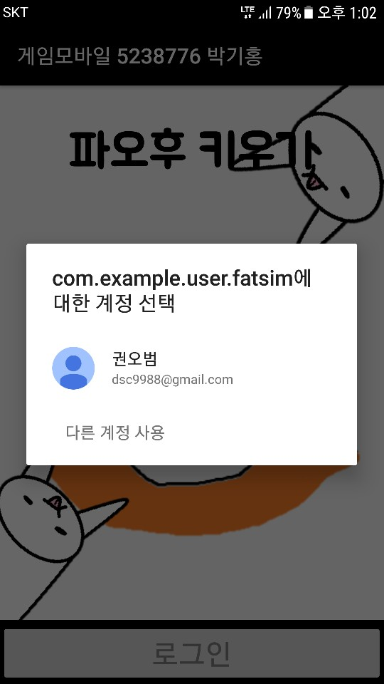
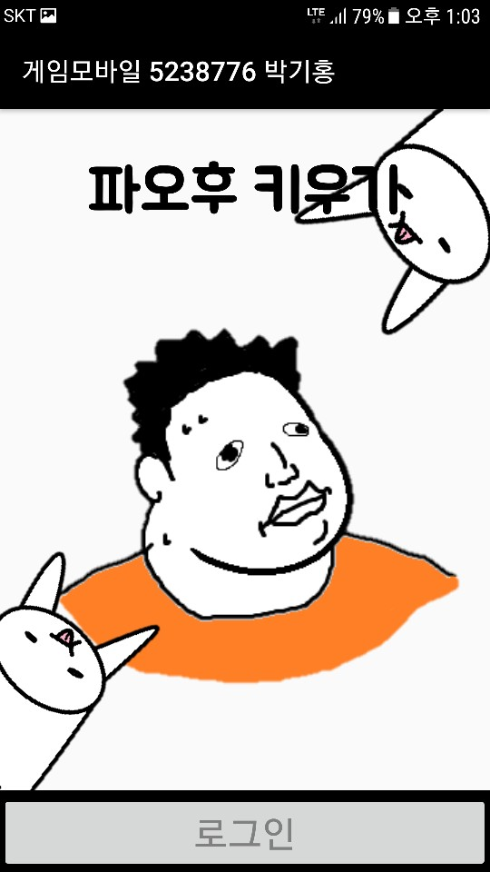
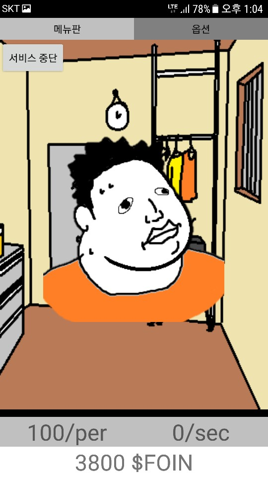
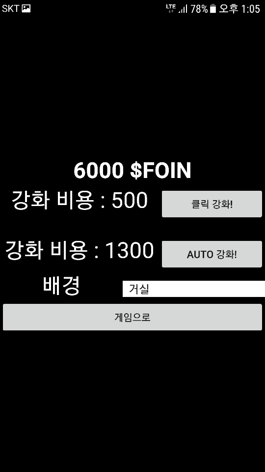
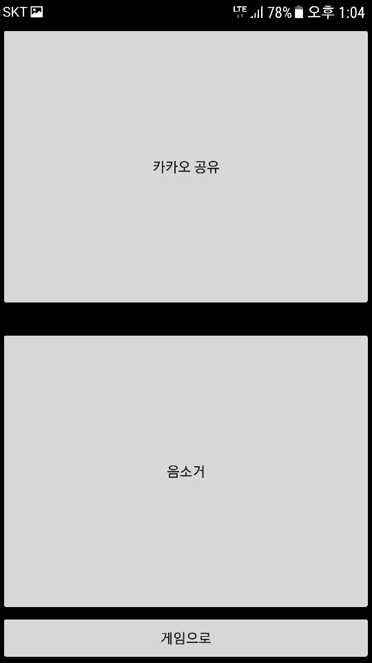
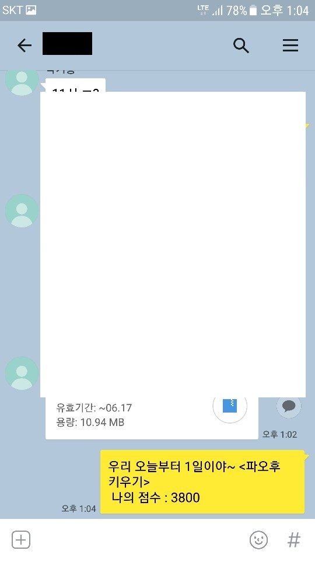
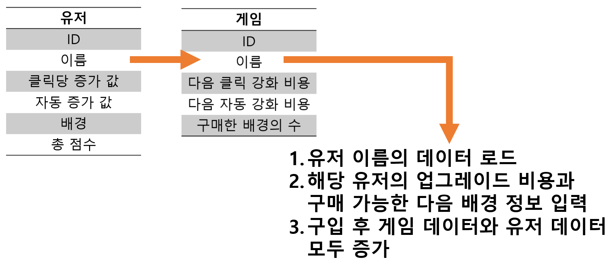

# FatSim
********************************************************************************************************
<article>
<b>#Project Member :</b> 1 Developer 
<b>#Language :</b> Java 
<b>#Platform :</b> Android 
<b>#Date :</b> 2017 
<b>#Video Link :</b> https://youtu.be/V7T6Vzx0gH4 
</article>
 

<body>
  <h1>요약</h1>
  

    

      간단한 클리커 게임을 제작하며 카카오에 공유 서비스와 구글플러스 로그인 정보를 받아 유저를 구별하여 게임 진행 데이터를 저장하는 기능을 구현해 보고 싶어 첫 Android-Studio를 어플리케이션으로 해당 프로젝트를 기획/제작 하였습니다. 
    

  

  
  <h1>주요 요소</h1>
  

    <ol>
      <li><b>사용된 시스템</b> 
          <ul>List Spinner</ul>
          <ul>SQLite DB 2개(게임 정보, 유저 정보)</ul>
          <ul>Intent를 통한 유저 정보 전달</ul>
          <ul>카카오톡 공유 서비스</ul>
          <ul>구글 플러스 계정 정보 저장</ul>
          <ul>AlertDialog를 통한 선택값 저장</ul>
          <ul>PNG 애니메이션 적용</ul>
          <ul>커스텀 폰트 적용</ul>
          <ul>액티비티 전환 애니메이션 활용</ul>
          <ul>미디어 플레이어를 통한 사운드 출력</ul>
      </li>
       
      <li><b>게임 씬</b> 
        - 메뉴 스크린을 터치하면 로그인 창을 통해 게임 화면으로 전환 
         
        - 주인공의 초상화 클릭시 점수 추가 
        - 자동 점수 추가 업그레이드를하면 매초마다 자동으로 점수 상승 
        * Service를 이용한 백그라운드 동작으로 어플리케이션이 닫혀도 점수 상승
         
        - <클릭 당 점수 증가 / 자동 점수 증가> 업그레이드 버튼 생성 
        - 업그레이드창에서 Alert Dialog를 통해 배경 변경 버튼 생성 
        - <b>모든 업그레이드는 적용과 동시에 SQLite로 동시에 정보가 저장됨</b> 
         
        - 옵션 창에서 카카오톡 공유 서비스가 가능한 버튼 제공 
        - 음성 음소거 기능 버튼 생성 
         
      </li>
       
      <li><b>데이터 호출/저장</b> 
      - 게임 로그인 후 유저의 이름을 기본키로 점수 증가 값, 구매한 배경의 수, 보유 점수 등 정보를 가진 데이터 호출 
      - 게임 씬 로드 후에는 다음 업그레이드에 필요한 값을 저장하고 있는 데이터 호출 
      - 게임을 종료하거나 업그레이드, 배경 구매가 이루어지면 다음 작업 시작 
        1. 유저 데이터는 업그레이드 성공으로 얻은 값을 해당 데이터에 저장 
        2. 게임 데이터는 업그레이드 성공 시, 다음 업그레이드에 필요한 값이나 배경을 지목하여 데이터 저장 
       
      </li>
       
      <li><b>사이툴을 통한 그래픽 제작 및 외부 폰트 적용</b> 
      - 게임 내부에 사용되는 그래픽 자체 제작 
      </li>
    </ol>
  

  <h2>짧은 작동 영상</h2>
  
</body>
